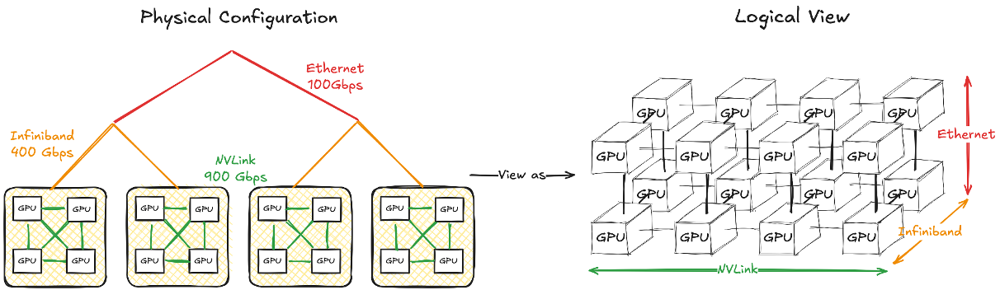

Cost Model
==========

Single-GPU Cost Modeling
-----------------------

**Latency / Runtime Cost Estimation**

* Roofline Model
  
  * Idea: :math:`\max(\text{compute time}, \text{memory access time})`
  * Use linear regression model for NVIDIA GPUs
  * Compute time model (:math:`\text{latency} + \text{bandwidth} \times \text{\#flops}`)
  * Memory access model (:math:`\text{latency} + \text{bandwidth} \times \text{\#bytes}`)

.. image:: img/linear_regression_for_runtime_cost_estimation.png
  :alt: Linear Regression for Runtime Cost Estimation
  :align: center
  :width: 100%

**Memory Cost Estimation**

* Memory cost estimation for each operator
  
  * Memory cost = peak memory usage + memory liveness analysis
  * Peak memory usage = :math:`\sum_{i=1}^{n} \text{max}(\text{input}_i, \text{output}_i)`
  
    * :math:`\text{input}_i` and :math:`\text{output}_i` are the input and output tensors of the operator
    * :math:`n` is the number of inputs/outputs

  * FX graph enables precise peak memory analysis
  * Memory liveness analysis
  
    * Track the time intervals during which tensors are alive

.. image:: img/memory_liveness_analysis.png
  :alt: Memory Liveness Analysis
  :align: center
  :width: 100%

Multi-GPU Cost Modeling
-----------------------
**Communication Modeling**

Challenge
* Communication cost varies for multi-level hierarchical communication
* Congestion may occur in certain scenarios
  
Device Mesh Abstraction

* Mapping the GPU network hierarchy into a N-dimension device mesh 
* Devices in the same mesh dimension have the same communication capability (latency, bandwidth)
* How to obtain the device mesh?
  
  * Current Approach: Predefined device mesh shape
  
    * Profile all-reduce among the devices in the same mesh dim
    * Linear regression along each mesh dim :math:`i` (:math:`\text{time}_i = \text{latency}_i + \text{bandwidth}_i \times \text{\#bytes}`)
  
  * In-Progress: Auto Mesh Discovery
    
    * Motivation 
      
      * More robust to complex communication architecture
      * More accurate since each dimension can be considered respectively
    
    * Profile the communication latency between each mesh dimension
    * Search the mesh shape where the communication time along the same dim with max similarity
    * Linear regression along each mesh dim :math:`i` (:math:`\text{time}_i = \text{latency}_i + \text{bandwidth}_i \times \text{\#bytes}`)

