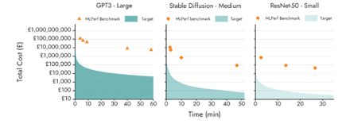
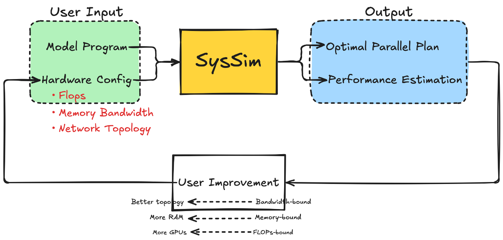

.. TorchCAP documentation master file, created by
   sphinx-quickstart on Wed Mar 26 14:44:20 2025.
   You can adapt this file completely to your liking, but it should at least
   contain the root `toctree` directive.

TorchCAP documentation
======================

Can we know if a 1000X hardware proposal is feasible?
-----------------------------------------------------

* Given target models (e.g., Llama), scenarios (e.g., training and inference) and hardware proposal (e.g., device FLOPS / Mem. bandwidth and interconnect)
* Predict performance and runtime analysis for operators (e.g., compute and communication)

Overview of TorchCAP
--------------------
**Main Components**

* System Cost Estimator
  * Predict the runtime and memory consumption of a model program
* Execution Plan Optimizer
  * Transform the model execution plan based on the cost estimation

Applications in AI Infrastructure
----------------------------------

* automatic parallelism
* resource scheduling 
* performance debugging

.. Add your content using ``reStructuredText`` syntax. See the
.. `reStructuredText <https://www.sphinx-doc.org/en/master/usage/restructuredtext/index.html>`_
.. documentation for details.

.. Include the background, motivation, and goals of the project here.
.. toctree::
  :maxdepth: 1
  :caption: Getting Started

  install.rst
  quickstart.rst

.. Include the methodology, and architecture of the project here.
.. toctree::
  :maxdepth: 1
  :caption: Deep Dive

  cost_model.rst
  auto_sharding.rst

